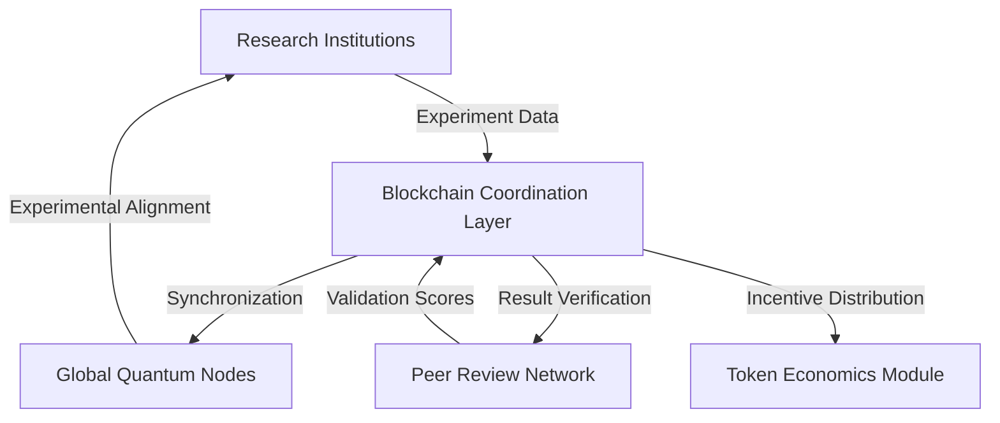

# QuantumSync: Decentralized Quantum Entanglement Experiment Coordination Platform

## 🌐 Project Vision

QuantumSync is a revolutionary blockchain-powered platform designed to transform global quantum entanglement research through decentralized coordination, transparent collaboration, and innovative incentive mechanisms.

## 🔬 Core Features

### 🕹️ Experiment Coordination
- Global synchronization of quantum experiments across distributed research sites
- Precise time-based experiment scheduling and alignment
- Real-time experimental parameter sharing and validation

### 📊 Blockchain-Verified Results
- Immutable, cryptographically secured experimental data storage
- Tamper-evident result verification mechanisms
- Transparent provenance tracking for quantum phenomena observations

### 💡 Incentive Mechanisms
- Native quantum research token ($QBIT)
- Tokenized rewards for:
    - Successful entanglement experiments
    - Breakthrough discoveries
    - Peer validation contributions
    - Novel experimental designs

### 🔍 Decentralized Peer Review
- Distributed expert validation network
- Reputation-based review scoring
- Transparent, stake-based evaluation processes

### 🚀 Quantum Technology Marketplace
- Platform for quantum entanglement-based application listings
- Smart contract-powered technology exchange
- Licensing and intellectual property management

## System Architecture



## Technology Stack

- **Blockchain**: Stacks (Proof of Transfer)
- **Smart Contract Development**: Clarinet
- **Smart Contract Language**: Clarity
- **Backend**: Distributed Consensus Protocols
- **Frontend**: React with Web3 Integration
- **Data Storage**: IPFS, Decentralized File Systems

## Development Roadmap

1. **Alpha Phase**
    - Core experiment coordination contracts
    - Basic synchronization mechanisms
    - Initial token economic model

2. **Beta Phase**
    - Advanced peer review systems
    - Enhanced data verification protocols
    - Marketplace prototype

3. **Production Phase**
    - Full global research network
    - Advanced quantum technology exchange
    - International research collaborations

## Smart Contract Testing with Clarinet

```bash
# Run comprehensive contract tests
clarinet test

# Test experiment coordination mechanisms
clarinet test --focus experiment-sync

# Verify peer review validation protocols
clarinet test --focus peer-review
```

## Getting Started

### Prerequisites
- Node.js (v16+)
- Stacks Wallet
- Clarinet CLI
- Web3-compatible browser

### Installation
```bash
# Clone the repository
git clone https://github.com/your-org/quantumsync.git

# Install dependencies
npm install

# Set up Clarinet development environment
clarinet integrate
```

## Security Considerations

- Quantum-resistant cryptographic protocols
- Multi-layer encryption for sensitive experimental data
- Continuous security audits
- Decentralized governance model
- Stake-based access controls

## Contribution Guidelines

We welcome contributions from researchers, developers, and quantum enthusiasts! Please review our `CONTRIBUTING.md` for detailed guidelines.

## Research Ethics

QuantumSync is committed to:
- Open science principles
- Transparent research methodologies
- Ethical technology development
- Global scientific collaboration

## License

Distributed under the MIT License. See `LICENSE.md` for more information.

## Contact

- **Project Coordination**: quantum-sync@research.network
- **Research Inquiries**: research@quantumsync.org
- **Community Discord**: https://discord.gg/quantumsync

---

*Entangling the future of scientific discovery, one quantum moment at a time.*
